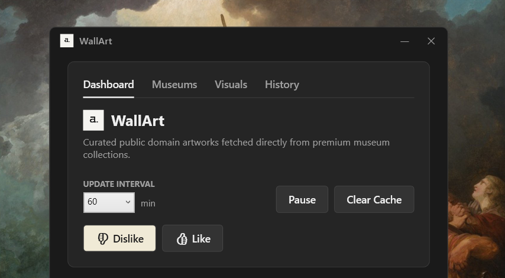
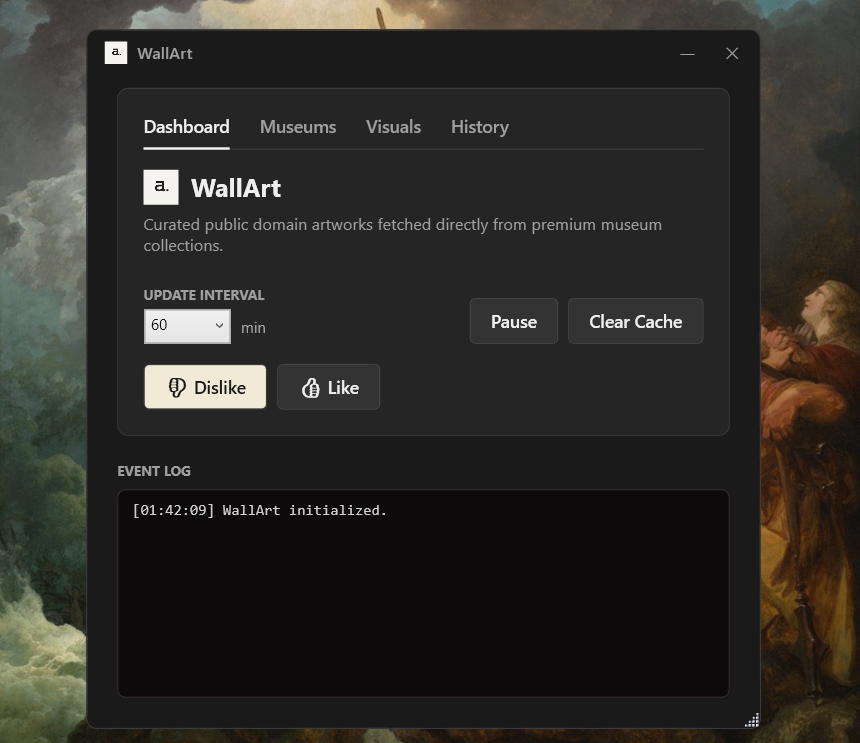
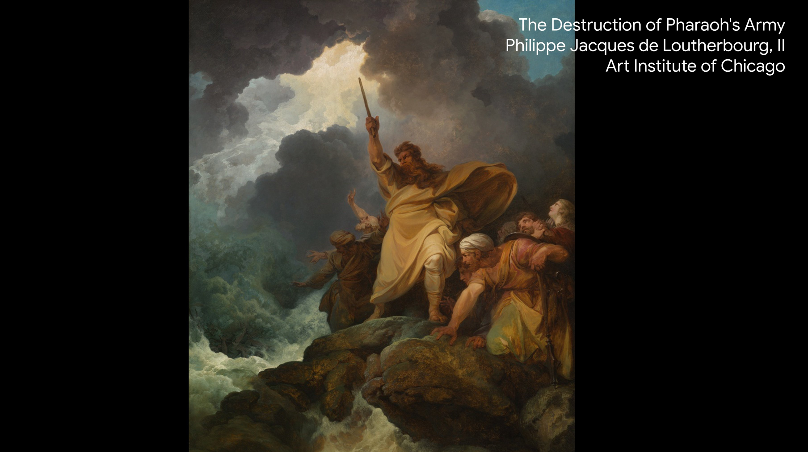
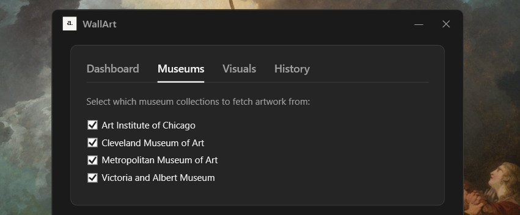

# 🖼️ WallArt



[![Download Now] ](https://github.com/shenfurkan/WallArt/releases/download/app/WallArtSetupV1.0.exe)

> A Windows desktop wallpaper daemon that automatically fetches and displays fine art from world-class museum collections.

WallArt runs silently in the system tray and refreshes your desktop wallpaper on a schedule, pulling high-quality artwork from public museum APIs. Each image is processed to fit your display and annotated with the title, artist, and source institution.

---

## Features

- **Automatic wallpaper updates** — fetches a new artwork at a configurable interval (default: every 60 minutes)
- **Multi-museum sources** — aggregates artwork from four major public collections:
  - 🏛️ Art Institute of Chicago
  - 🏛️ Metropolitan Museum of Art (New York)
  - 🏛️ Cleveland Museum of Art
  - 🏛️ Victoria and Albert Museum (London)
- **Smart image processing** — resizes and crops artwork to 4K (3840×2160) using Lanczos3 resampling; letterboxes portraits with a black background
- **Typography overlay** — renders the artwork title, artist name, and source institution directly onto the wallpaper using Google Sans (configurable position and scale)
- **Like / Dislike** — skip unwanted artwork immediately; disliked works are blacklisted so they never appear again
- **Per-provider toggles** — enable or disable individual museum sources from the Settings tab
- **Dimming & blur controls** — apply Gaussian blur and/or a dark overlay for use as a desktop background behind light-coloured widgets
- **Local cache** — downloaded images are saved to `Pictures\Wallpaper Art` for browsing; configurable cache size limit (default: 50 images)
- **System tray daemon** — runs with below-normal process priority; double-click the tray icon to open the UI
- **Windows autostart** — optional registry entry to launch WallArt silently with Windows (`--autostart` flag)
- **Multi-monitor support** — sets the wallpaper on every connected monitor via the `IDesktopWallpaper` COM API, with a fallback to `SystemParametersInfo`

---

## Screenshots

### Interface


### Example Wallpaper


### Museum Section

---

## Requirements

| Requirement | Detail |
|---|---|
| OS | Windows 10 / 11 |
| Runtime | .NET 10 (self-contained build available) |
| Disk space | ~50 MB for the app + up to ~500 MB for the image cache |
| Internet | Required for artwork fetching |

---

## Installation

### Option A — Installer (recommended)

1. Click the **[Download Now](https://github.com/shenfurkan/WallArt/releases/download/app/WallArtSetupV1.0.exe)** button at the top of this page, or download `WallArtSetupV1.0.exe` from the [Releases](https://github.com/shenfurkan/WallArt/releases/latest) page.
2. Run the installer. No administrator rights required.
3. Optionally tick **"Start WallArt with Windows"** during setup.
4. The app launches after installation. It appears in the system tray.

### Option B — Portable

1. Download and extract the portable ZIP from [Releases](../../releases).
2. Run `WallArt.exe`.

---

## Building from Source

```
git clone https://github.com/your-username/WallArt.git
cd WallArt
dotnet build
```

To publish a self-contained executable:

```
dotnet publish -c Release -r win-x64 --self-contained true
```

Or use the included script:

```
.\publish.bat
```

### Packaging the Installer

Requires [Inno Setup 6+](https://jrsoftware.org/isdl.php).

```
ISCC.exe installer.iss
```

The installer will be written to `installer_output\WallArt_Setup.exe`.

---

## Usage

| Action | How |
|---|---|
| Open UI | Double-click the tray icon |
| Skip to next artwork | Right-click tray → **Dislike (Next)**, or click **Dislike** in the UI |
| Like current artwork | Click **Like** in the UI (saves to favourites) |
| Open image cache | Right-click tray → **Open Cache** |
| Exit | Right-click tray → **Exit** |

### Settings

| Setting | Default | Description |
|---|---|---|
| Update interval | 60 min | How often a new artwork is fetched |
| Cache size | 50 | Maximum number of images to keep locally |
| Autostart | On | Launch with Windows |
| Background blur | 0 | Gaussian blur radius applied to the wallpaper |
| Background dimming | 0 | Dark overlay opacity (0 = none, 1 = fully black) |
| Typography position | Top Right | Where the artwork label is drawn |
| Typography scale | 1.0 | Size multiplier for the text overlay |

---

## Architecture

```
WallArt/
├── App.xaml.cs                   # DI container setup, tray icon, startup logic
├── MainWindow.xaml               # UI (tabs: Now Playing, History, Settings, Log)
├── Models/
│   ├── WallArtConfig.cs          # Persisted configuration model
│   └── ArtworkResult.cs          # Artwork metadata (title, artist, URL, …)
├── Services/
│   ├── ConfigurationService.cs   # Load/save JSON config (AppData\WallArt)
│   ├── WallpaperManager.cs       # Set wallpaper, manage cache, autostart
│   ├── ImageProcessingService.cs # Resize, blur, dim, draw typography overlay
│   ├── LogService.cs             # In-memory event log
│   └── Providers/
│       ├── IArtProvider.cs                    # Provider interface
│       ├── ArtProviderOrchestrator.cs         # Selects & retries providers
│       ├── ArtInstituteOfChicagoProvider.cs
│       ├── MetropolitanMuseumOfArtProvider.cs
│       ├── ClevelandMuseumOfArtProvider.cs
│       └── VictoriaAndAlbertMuseumProvider.cs
└── ViewModels/
    └── MainViewModel.cs          # Commands, timer, state binding
```

---

## Uninstallation

Run the uninstaller from **Add or Remove Programs**, or run:

```
WallArt.exe --uninstall
```

This removes the autostart registry entry and deletes the local configuration. You will be asked whether to also delete the image cache.

---

## Dependencies

| Package | Purpose |
|---|---|
| [H.NotifyIcon.Wpf](https://github.com/HavenDV/H.NotifyIcon) | System tray icon |
| [SixLabors.ImageSharp](https://github.com/SixLabors/ImageSharp) | Image resizing and processing |
| [SixLabors.ImageSharp.Drawing](https://github.com/SixLabors/ImageSharp.Drawing) | Typography rendering |
| [SixLabors.Fonts](https://github.com/SixLabors/Fonts) | Embedded Google Sans font |
| Microsoft.Extensions.DependencyInjection | DI container |
| Microsoft.Extensions.Http | `HttpClient` factory |

---

## Data & Privacy

WallArt only communicates with public museum APIs (no account or API key required). No personal data is transmitted. All downloaded images are stored locally in `Pictures\Wallpaper Art`.

---

## License

This project is open source. See [LICENSE](LICENSE) for details.
