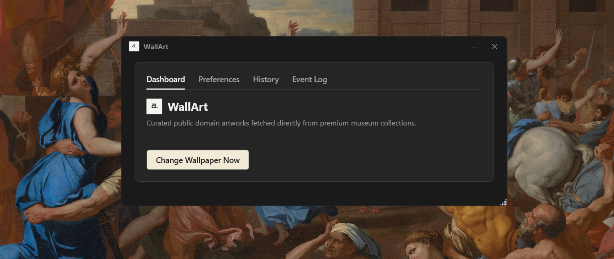
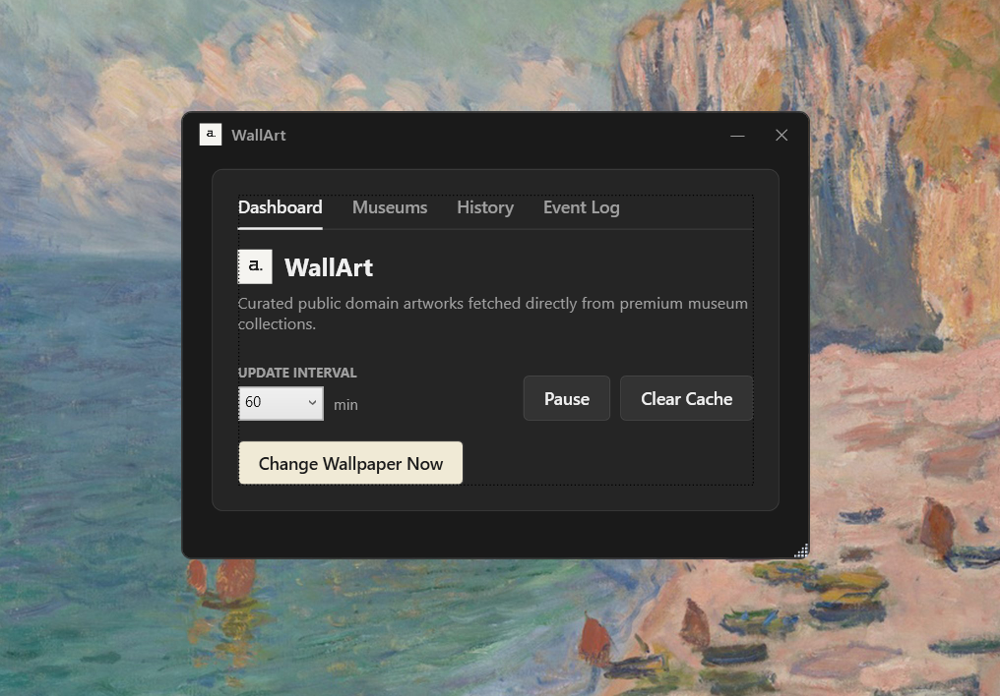
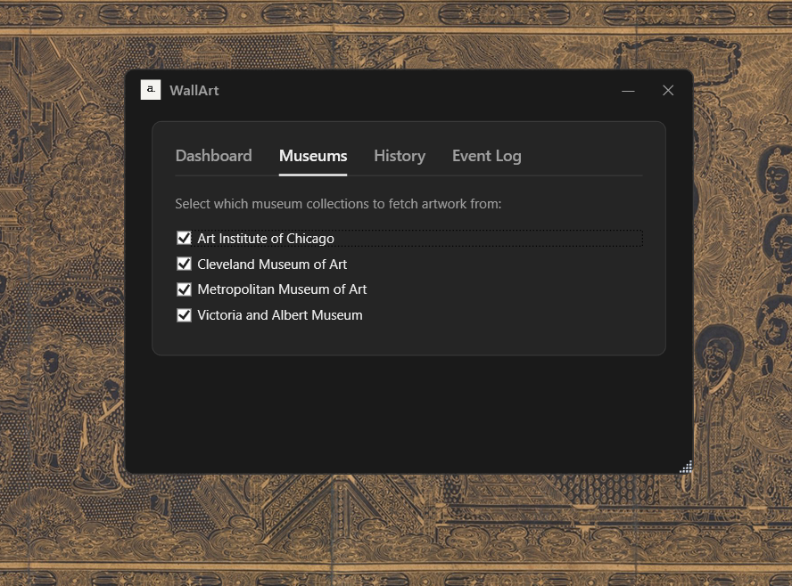

# WallArt



> A Windows desktop wallpaper daemon that automatically fetches and displays fine art from world class museum collections.

WallArt runs quietly in the background and updates your desktop wallpaper on a customizable schedule, fetching high-quality artworks from public museum APIs. Each image is processed to fit your screen perfectly and is accompanied by details including the title, artist, and source institution.

## Features

- **Automatic Wallpaper Updates** — Fetches a new artwork at a configurable interval (default: every 60 minutes).
- **Multiple Museum Sources** — Aggregates artwork from four major public collections:
  - 🏛️ Art Institute of Chicago
  - 🏛️ Metropolitan Museum of Art (New York)
  - 🏛️ Cleveland Museum of Art
  - 🏛️ Victoria and Albert Museum (London)
- **Smart Image Processing** — Resizes and crops artwork to 4K (3840×2160) using Lanczos3 resampling; intelligently letterboxes portraits with a black background.
- **Typography Overlay** — Renders artwork metadata (title, artist, and source) directly onto the wallpaper using the Google Sans font (configurable position and scale).
- **Instant Refresh** — Skip any artwork immediately with a single click.
- **Provider Customization** — Enable or disable individual museum sources via the Settings tab.
- **Local Cache Management** — Downloaded images are saved to `Pictures\Wallpaper Art` for offline browsing; includes a configurable cache size limit (default: 50 images).
- **Windows Autostart** — Simple registry-based integration to launch WallArt silently at login.
- **System Tray Integration** — Minimizes perfectly to the system tray, running unobtrusively in the background without cluttering the taskbar.

---

## Screenshots
### Interface


### Example Wallpaper


### Museum Selection


### System Tray


## Architecture

WallArt follows the **MVVM (Model-View-ViewModel)** architectural pattern to ensure a clean separation of concerns and maintainability.

- **Models**: Defines the core data structures, such as `ArtworkResult` and application configuration `WallArtConfig`.
- **Views**: The user interface built with WPF (`MainWindow.xaml`).
- **ViewModels**: Handles presentation logic and UI state (`MainViewModel`).
- **Services**: Encapsulates core application logic and external integrations:
  - **Art Providers**: Implements the `IArtProvider` interface to fetch artworks from various museum APIs.
  - **Image Processing**: Handles resizing, cropping, and rendering typography onto images (`ImageProcessingService`).
  - **Wallpaper Manager**: Manages setting the Windows desktop wallpaper (`WallpaperManager`).
  - **Configuration**: Manages application settings and user preferences (`ConfigurationService`).
  - **Scheduling**: Orchestrates the automatic fetching and updating of wallpapers at configured intervals (`SmartScheduler`).

## Requirements

| Requirement | Detail |
|---|---|
| OS | Windows 10 / 11 |

### Installer (Recommended)

1. Click the [Download](https://github.com/shenfurkan/Wallart/releases) button
2. Run the installer. No administrator rights are required.
3 The application will launch automatically  start on background.


## Building from Source

```powershell
git clone https://github.com/shenfurkan/Wallart.git
cd WallArt
dotnet build
```

## Uninstallation

Use **Add or Remove Programs** or run the following command from the application directory:

```powershell
WallArt.exe --uninstall
```

This removes the autostart registration and local configuration. You will be prompted to either keep or delete the image cache.

## Data & Privacy

WallArt interacts exclusively with public museum APIs. No personal data is collected or transmitted. Downloaded images are stored locally in your `Pictures\Wallpaper Art` directory.

## License

This project is open-source. See the [LICENSE](LICENSE) file for more details.

